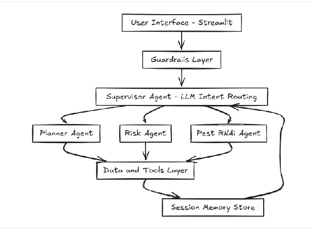

# 🌾 Agentic Farm Planner

**An autonomous AI system that plans seasonal farming and alerts to weather/pest risks.**

> Agentic AI system with LLM-based supervisor routing, 4 agents (planning/risk/pest), safety guardrails, transparent reasoning, and session memory.

## What It Does (30 Seconds)

Type: **"Plan Kharif rice in Tamil Nadu"**

The system:
1. Routes your request via **LLM semantic reasoning** (not keywords)
2. Generates **month-wise task plans** with risk alerts
3. **Protects privacy** (PII masking) and **blocks unsafe requests**
4. **Explains decisions** in real-time logs

## Quick Start

```bash
pip install -r requirements.txt
ollama pull phi3:mini  # Separate terminal: ollama serve
streamlit run ui/app.py
```

Then visit **http://localhost:8501** and try the demo.

## System Architecture



**Key Components:**
1. **Supervisor Agent** - LLM-driven intent routing (phi-3-mini)
2. **Planner Agent** - Crop calendars + readiness checklists
3. **Risk Agent** - Weather alerts and monthly risk assessment
4. **Pest/RNAi Agent** - Safe pest guidance (no chemical dosages)
5. **Guardrails** - PII masking + safety filters
6. **Memory** - Session-scoped context persistence

**Data Flow:**
```
User Input → Guardrails → Supervisor → [Planner|Risk|Pest] → Tools/Data → Response
(PII mask)   (safety)    (LLM route)        ↓
                                      Memory Store
```

See [ARCHITECTURE.md](ARCHITECTURE.md) for detailed technical design.

---

## 📂 Project Structure

```
Agentic-Agri-Farm-Planner/
├── agents/
│   ├── supervisor_agent.py      # LLM-based routing
│   ├── planner_agent.py         # Calendar + tasks
│   ├── risk_agent.py            # Weather assessment
│   └── pest_agent.py            # RNAi guidance
├── guardrails/
│   ├── pii.py                   # Email/phone masking
│   └── safety.py                # Medical/chemical filters
├── data/
│   ├── crop_calendar.json       # Rice/Wheat/Cotton calendars
│   ├── weather_mock.json        # Monthly risk data
│   └── readiness_defaults.json  # Input checklists
├── tools/
│   ├── crop_calendar_loader.py
│   └── weather_api.py
├── memory/
│   └── session_store.py
├── ui/
│   └── app.py                   # Streamlit interface
├── test_guardrails.py           # Unit tests
├── demo_prompts.py              # Quick demo scripts
├── ARCHITECTURE.md              # Detailed design doc
├── requirements.txt
└── README.md
```

---

## 🚀 Quick Start

### Prerequisites
- Python 3.11+
- [Ollama](https://ollama.ai) installed and running

### Installation

1. **Clone and navigate:**
```bash
cd Agentic-Agri-Farm-Planner
```

2. **Install dependencies:**
```bash
pip install -r requirements.txt
```

3. **Pull LLM model:**
```bash
ollama pull phi3:mini
```

4. **Run tests (optional):**
```bash
python test_guardrails.py
```

5. **Launch UI:**
```bash
streamlit run ui/app.py
```

6. **Open browser:** http://localhost:8501


## 🛡️ Guardrails

### PII Masking
| Input | Masked Output |
|-------|---------------|
| `farmer@example.com` | `f***r@example.com` |
| `9876543210` | `********10` |

### Safety Filters
**Blocked topics:**
- Medical advice
- Chemical dosage prescriptions
- Illegal/contraband content

**Response:** Advisory disclaimer + request block + log entry

---

## 📊 Data Sources

### Crops & Locations
| Crop | States | Seasons |
|------|--------|---------|
| Rice | Tamil Nadu, Punjab | Kharif, Rabi |
| Wheat | Punjab, Tamil Nadu | Rabi |
| Cotton | Maharashtra, Punjab | Kharif |

### Task Explanation Format
**TASK → WHEN → WHY → HOW → RISK**

Example: `Transplanting | First fortnight of July | Align seedlings with stable rain | 20x15 cm spacing, healthy seedlings | Medium (heat stress in dry spells)`

### Readiness Checklist (Non-Monetary)
- ✅ Seed availability
- ✅ Fertilizer type needed
- ✅ Irrigation dependency
- ✅ Labor intensity
- ✅ Weather risk flags

---

## 🧪 Testing

Run guardrails unit tests:
```bash
python test_guardrails.py
```

Expected output:
```
✓ Email masking: Contact me at f***r@example.com
✓ Phone masking: Call me at ********10
✓ PII detection working
✓ Redact and flag: Email: f***r@farm.com, phone: ********99
✓ Safety filter working
✓ Enforce safety: This system provides advisory guidance...

✅ All tests passed!
```

---

## ⚙️ Configuration

### Supervisor Agent Settings
- **Model:** `phi3:mini` (default)
- **Endpoint:** `http://localhost:11434/api/chat`
- **Fallback:** Heuristic routing if LLM unavailable
- **Mock mode:** Set `mock=True` in supervisor initialization

### Data Files
- Crop calendars: [data/crop_calendar.json](data/crop_calendar.json)
- Weather risks: [data/weather_mock.json](data/weather_mock.json)
- Readiness defaults: [data/readiness_defaults.json](data/readiness_defaults.json)

---

## ⚠️ Limitations

**Phase-1 Scope (by design):**
- ❌ Uses static calendars and mock weather (no live APIs)
- ❌ No budgeting or cost optimization
- ❌ No embeddings or vector search
- ❌ Session memory only (no persistence)
- ❌ English language only
- ❌ Supervisor relies on local Ollama (fallback is heuristic)

**Explicitly deferred to Phase-2:**
- Budget optimization & subsidy linkage
- Live weather APIs & market pricing
- Multilingual support & offline mode
- Richer agronomy models & ML predictions

---

## 🎯 Evaluation Criteria

| Criterion | Phase-1 Implementation |
|-----------|----------------------|
| **Agentic behavior** | ✅ LLM-based supervisor routing, no hardcoded rules |
| **Tool usage** | ✅ Static data loaders, JSON parsers |
| **Memory** | ✅ Session store for crop/location/history |
| **Guardrails** | ✅ PII masking + safety filters with disclaimers |
| **Transparency** | ✅ Visible logs panel showing reasoning |
| **Completeness** | ✅ Calendar vs. tasks validated; risk integration |
| **Clarity** | ✅ TASK→WHEN→WHY→HOW→RISK format |
| **Adaptability** | ✅ Supervisor re-routes based on context changes |

---

## 📚 Documentation

- **Architecture:** [ARCHITECTURE.md](ARCHITECTURE.md) - Detailed system design
- **Demo Prompts:** [demo_prompts.py](demo_prompts.py) - Pre-built test cases
- **Tests:** [test_guardrails.py](test_guardrails.py) - Guardrails validation

---

## 🚦 Troubleshooting

### Issue: `ModuleNotFoundError: No module named 'agents'`
**Fix:** Run from project root and ensure `__init__.py` files exist:
```bash
cd Agentic-Agri-Farm-Planner
python -m streamlit run ui/app.py
```

### Issue: Ollama connection fails
**Fix:** Start Ollama service and pull model:
```bash
ollama serve
ollama pull phi3:mini
```

### Issue: Supervisor uses fallback routing
**Reason:** Ollama not running or model not pulled
**Impact:** Still functional but uses heuristic routing instead of LLM

---

## 🔮 Phase-2 Roadmap

1. **Budget & Economics**
   - Cost estimation per task
   - Subsidy linkage (state schemes)
   - Market price integration

2. **Live Data**
   - Weather API (IMD/OpenWeather)
   - Soil health data
   - Pest outbreak alerts

3. **Advanced AI**
   - Larger models (llama-3-70b, mixtral)
   - Embeddings for semantic memory
   - Multi-turn conversation optimization

4. **User Experience**
   - Multilingual support (Hindi, Telugu, Tamil)
   - Mobile-responsive PWA
   - Offline mode with sync

5. **Integration**
   - Export to CSV/PDF
   - SMS/WhatsApp alerts
   - Government portal APIs

---

## 📄 License

MIT License - See LICENSE file for details

---

##  Acknowledgments

- Problem statement: Agriculture track - Seasonal Farm Planner & Risk Alert Agent
- Data sources: FAO, ICAR guidelines (simplified for demo)
- Tech: Ollama, Streamlit, phi-3-mini
